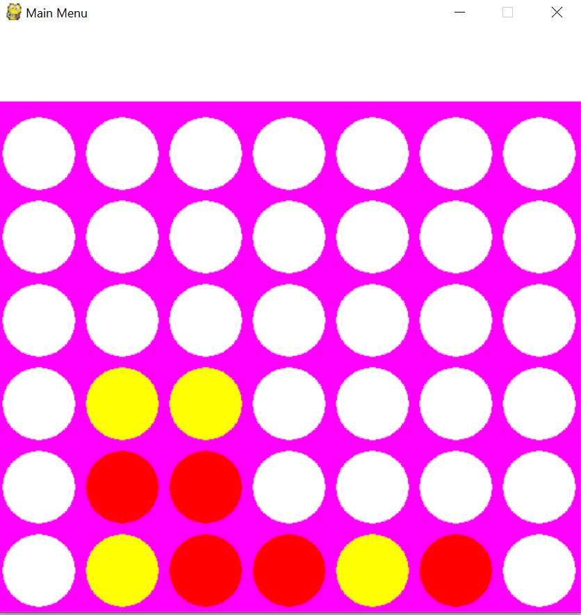
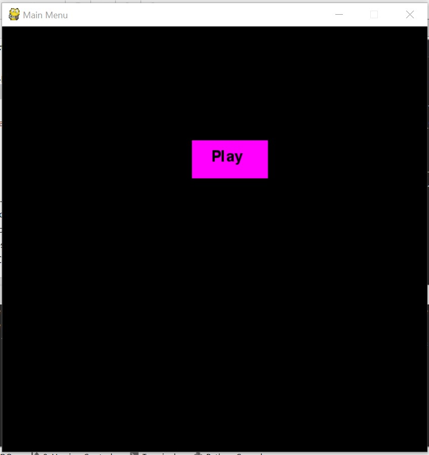
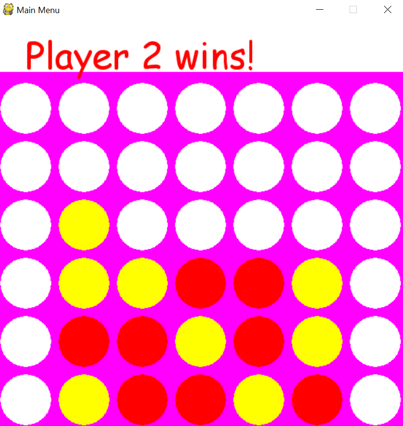
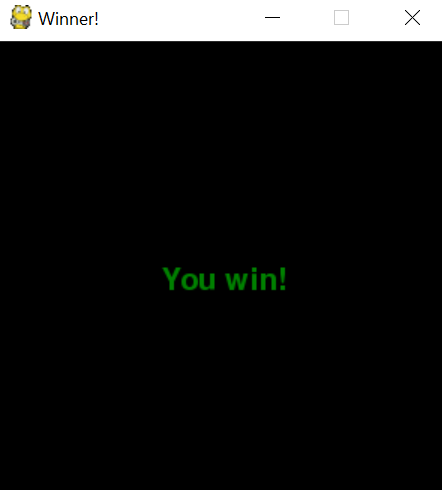

# csc290-connectfour
by Simran, Andi, Onimisi, Maria and James

## Game Description

This game is a python implementation of the popular board game
connect four. 

Connect four is a 2 player game, and the rules are very straight forward. You each take turns placing disks and whoever gets 4 disks either vertically, diagonally, or horizontally wins. Keep in mind that whenever a player places a disk, the disk is placed at the lowest possible row, and the disks stack on top of eachother.

## Installation guide
***
  ### Software needed:
  * [Pygame](https://www.pygame.org/download.shtml)
  * A Python IDE of your choice, we recommend [PyCharm](https://www.jetbrains.com/pycharm/download/?utm_source=product&utm_medium=link&utm_campaign=PC&utm_content=2018.3#section=windows)

  ### How to install
   * Git clone the repo into a local directory of your choice.
   * Open PyCharm and create a project from the directory you cloned into.
   * Start the game by running `menu.py` in the IDE. 
    

## Game controls

When you start the game, click the play button to advance to the game screen. There are two players, so you each take turns placing one disk, player 1 is red, and player 2 is yellow. Place disks by clicking on the column you want to drop the disk in.

## How to Play:
* The first turn is taken by Player 1.
* Keep taking turns placing disks until a winner is declared.
* A winner is declared is player has four consecutive disks in 
either of the directions vertical, horizontal, or diagonal.

## Game Screenshots
***

## Documentation
*** 
Documentation about our project and directory structure can be found at the [wiki page](https://github.com/AFYY/csc290-connectfour/wiki) for our repo.

## Contributions
***
  ### Onimisi Ayira, github username: ayira-onimisi:
   * I implemented about 95% of `board_view.py` with the gameplay, I wasn't responsible for adding a check for a winning move. I also
    implemented about 50% the class `board.py`, all the methods apart from the `check_winner()` method and the functions that  `check_winner()` uses. I also created `colors.py`. In the readme I wrote the Installation guide, the Documentation page([the wiki page](https://github.com/AFYY/csc290-connectfour/wiki)), I added screenshots to the readme and I also selected the license used for our project. 
  
  ### Simranjeet Bilkhu, GitHub username: simran-sb:
   * I wrote the check_winner, check_verticle, check_horizontal methods in board.py. I also wrote the menu.py module, win_screen.py mode and the button.py module and edited the others so that they work together properly.
     In the readme, I wrote the game controls and description sections
     
  ### Maria Abdul Karim, GitHub username: mariaakarim:
  * I implemented method check diagonal in board.py. I also fixed few bugs in the existing code in board.py, board_view.py, and menu.py. 
  I was also responsible to completing the docstrings in all of our game files. Moreover, I also wrote the "How to Play" section in README.md.
    
## License

This project was built by Simran, Andi, Onimisi, Maria and James under the MIT license.

The License can be found [here](license.txt)
